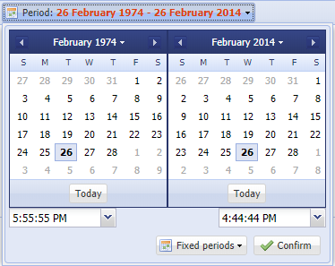

Date Range Picker Component for ExtJS
-------------------------------------

**Source at GitHub**

[https://github.com/wencywww/Ext.ux.button.DateRangePicker](https://github.com/wencywww/Ext.ux.button.DateRangePicker)

**Demos**

[Sencha's Fiddle: https://fiddle.sencha.com/#fiddle/10t2](https://fiddle.sencha.com/#fiddle/10t2)

[JSFiddle: http://jsfiddle.net/mx_starter/xLvg5yj6/](http://jsfiddle.net/mx_starter/xLvg5yj6/)

**Features:**

  * Easily choose period between two dates via a single button
  * Can be used everywhere within the app, just as a normal button	  
  * Optionally, include start/end times in the dates
  * Optionally, two datefield components could be bound and automatically updated by the pickers
  * 5 preset periods available for quick set - this week, last week, this month, last month, this year
  * Custom formats accepted for dates and times
  * Customizable captions, icons  
  * Customizable via a simple config object
  * Returns an object containg the period details via the getPickerValue() method
  * Returned object also containg PRECISED period details, eg. 13 months are shown as 1 year and 1 month and so on
  * Tested with ExtJS version 4.2.1.883 and up to 7.0.0.151  

**Component layout:**

  * It is a ExtJS button with a menu
  * The menu includes a single item, panel
  * The panel has separate containers for start/end datepickers and timefields
  * The panel includes 2 buttons for choosing the preset periods / confirming the choice

    
**Config object**

  * The config object is optional, if some of the configs are not provided, or there is no config object at all, defaults are applied
  * Config object name is **drpDefaults** and accepts the following keys
  * **selectedStart**, string in the format 'Y-m-d', sets the first datepicker value, defaults to the first day of the curren month
  * **selectedEnd**, string in the format 'Y-m-d', sets the second datepicker value, defaults to today
  * **dateFormat**, string in the Ext.Date.parse() recognisable format, determines how the dates are shown by the component, defaults to 'Y-m-d'
  * **showButtonTip**, boolean value, if true, applies a tooltip to the main button with a current selection, defaults to true
  * **showTimePickers**, boolean value, if true, two timefields are added below the datepickers to be able to choose start/end times
  * **timeFormat**, formatting string for the timefields, must be recognisable by Ext.Date.parse()
  * **timePickerFromValue**, string with a value of the first timefield, must be recognisable by Ext.Date.parse() and MUST MATCH the timeFormat config, defaults to 'H:i:s'
  * **timePickerToValue**, string with a value of the second timefield, must be recognisable by Ext.Date.parse() and MUST MATCH the timeFormat config, defaults to 'H:i:s'
  * **timePickersEditable**, boolean value, if true, the timefields combos will be editable, defaults to false
  * **timeIncrement**, number, indicating the step (in minutes) the timefield's combo records are generated, defaults to 5
  * **timePickersQueryDelay**, number, the timefield's combos query delay, defaults to 500
  * **timePickersWidth**, number, the timefield's width, defaults to 100
  * **mainBtnTextPrefix**, string, the prefix of the main button, defaults to 'Period: '
  * **mainBtnIconCls**, string, for setting an icon of the main button, use null if icon is not needed, defaults to 'drp-icon-calendar' 
  * **mainBtnTextColor**, string, for setting the main button text color (excludng the prefix), defaults to '#000000'
  * **confirmBtnText**, string, the text of the bottom-right confirm button, defaults to 'Set Range'
  * **confirmBtnIconCls**, string, for setting an icon of the confirm button, use null if icon is not needed, defaults to 'drp-icon-yes' 
  * **presetPeriodsBtnText**, string, the text of the bottom-left preset period button, defaults to 'Preset Periods'
  * **presetPeriodsBtnIconCls**, string, for setting an icon of the preset period button, use null if icon is not needed, defaults to 'drp-icon-calendar' 
  * **presetPeriodsThisWeekText**, string, menu option text for choosing this week, defaults to 'This Week'
  * **presetPeriodsLastWeekText**, string, menu option text for choosing last week, defaults to 'Last Week'
  * **presetPeriodsThisMonthText**, string, menu option text for choosing this month, defaults to 'This Month'
  * **presetPeriodsLastMonthText**, string, menu option text for choosing the last month, defaults to 'Last Month'
  * **presetPeriodsThisYearText**, string, menu option text for choosing the last week, defaults to 'This Year',
  * **bindDateFields**, boolean, if true, allows two date fields to be bound to the picker and automatically updated, defaults to false
  * **boundStartField**, Ext.form.field.Date instance, to be bound to the first datepicker, defaults to null
  * **boundEndField**, Ext.form.field.Date instance, to be bound to the second datepicker, defaults to null
  * **diffPreciseUnits**, object, customizes precised period details captions for year/years, month/months, day/days and so on, used to build the diffAsText property of the periodDetailsPrecise object part of the responce, defaults to 
  
  
  `{
        year: 'year',
        years: 'years',
        month: 'month',
        months: 'months',
        day: 'day',
        days: 'days',
        hour: 'hour',
        hours: 'hours',
        minute: 'minute',
        minutes: 'minutes',
        second: 'second',
        seconds: 'seconds',
        delimiter: ' '
    }`

  
**Usage**

  * Include the `css/DateRangePicker.css` file (can be ommited if not using icons, or you want to use own icons)
  * Include the `src/dateRangePicker.js` file (Ext must be included prior to this)
  * Instantiate the class, for example `var myRangePicker = Ext.create('Ext.ux.button.DateRangePicker', drpDefaults: {} )`, or using the 'daterangepicker' xtype
  * To get the value of the instance, use `var myPickerValue = myRangePicker.getPickerValue()` and inspect the myPickerValue object
  

**List of Changes**

  * **2019-10-10**, added e preview picture to the repository, changed Sencha Fiddle's ExtJS version to be 7.0.0.151 by default
  * **2017-05-18**, renamed picker's getValue() to getPickerValue() to work with 6.2/6.5
  * **2015-11-12**, added 'requires' config for including Ext.picker.Date & Ext.form.field.Time if needed
  * **2015-11-12**, added support for binding two datefield components to the picker and automatically set their values upon picker change
  * **2015-11-12**, added diffPreciseUnits config option for customizing captions used to build the diffAsText property of the periodDetailsPrecise object part of the responce
